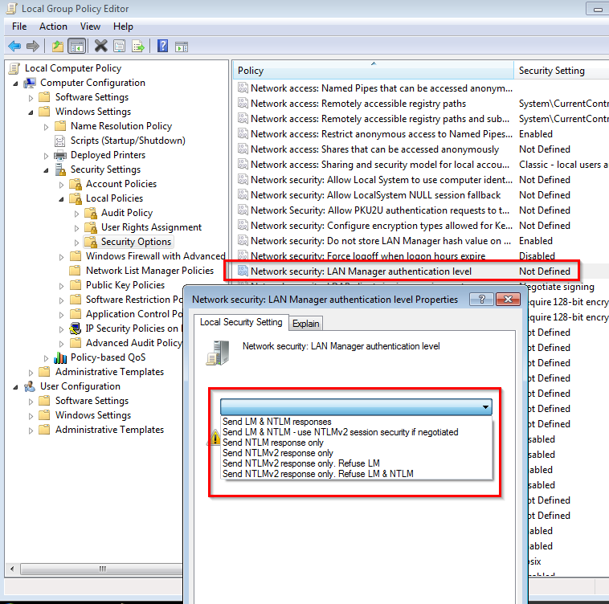

# Showing AD information in Oracle EBS (12.1) Using NTLM passthrough from Browser

## About

This document descibes how to retrieve Windows AD username and domain information in Oracle EBS environment when NTLM passthrough is configured in browsers.  A sample proof-of-concept code is provided to demostrate this feature.  If it's working, you can further customize it to fit your requirements.

This code is working ONLY when

- Browser is set to use NTLM passthrough (see Appendix for details)
- The client browser is running under Windows 7/10 in corporate envrionment, 
i.e. An OS with AD user logged on under a domain through Corporate AD.
- NTLMv1 is used.  NTLMv2 does **not** work.  (see Appendix for details)
 As of writing, this code is tested with IE11, Edge (Windows 10), Google Chrome v77, and Mozilla Firefox v69.

### Deployment

- Put the file `NTLM.jsp` to `$OA_HTML` in app server.
- Download Java CIFS Client Library jar from `https://www.jcifs.org/src/jcifs-1.3.19.jar`
- Transfer jcifs-1.3.19.jar to app server, e.g. /tmp folder.  Extract folder `jcifs` and transfer to `$JAVA_TOP` 

```
cd /tmp
jar xf jcifs-1.3.19.jar jcifs
mv jvcif $JAVA_TOP
```

- Bounce App server

## Testing

- Log on to your EBS instance as usual
- The URL will become something like 
`http(s)://erp.hostname.com:8000/OA_HTML/OA.jsp?OAFunc=OAHOMEPAGE`. Change it to `/OA_HTML/NTLM.jsp`
- You should see a list of data collected from NTLM, client browser, and server session.


## Appendix

### Browser Setup

- For Internet Explorer / Edge, your EBS URL must be in zone "Local Intranet" or "Trusted sites". In such zone, the custom level must provide `Automatic login with current user and password`.


- Google Chrome browser can pick up this IE security setting.  No further configuration needed.

- For Firefox, type `about:config` in the address bar
  - Set `network.automatic-ntlm-auth.trusted-uris` to _http(s)://erp.hostname.com_
  - Set `network.negotiate-auth.delegation-uris` to _http(s)://erp.hostname.com_
  - Set `network.negotiate-auth.trusted-uris` to _http(s)://erp.hostname.com_
  - Set `signon.autologin.proxy` to `true`

### NTLM setting

- If you see a blank page, it probably your OS is configured to use NTLM v2 for AD authentication.  To check the setting:

- Use `Start->Run` and type in `gpedit.msc` in the `Run` dialog box.  A `Group Policy` window will open.

- Select `Local Computer Policy` -> `Computer Configuration` -> `Windows Settings` -> `Security Settings` -> `Local Policies` -> `Security Options`.

- Find the policy `Network Security: LAN Manager authentication level`.
Right click on this policy and choose `Properties`.

- To ensure NTLM v1 is used, select `Send NTLM response only"


